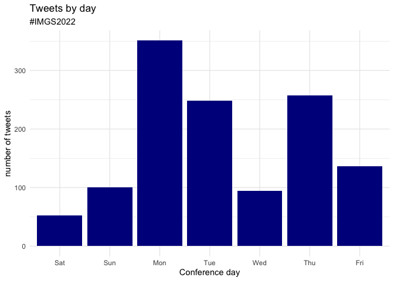

IMGS2022 Twitter
================

A look at twitter use at the 2022 IMGS conference.

The top 11 users (since imgs2022 is in there too)

| Twitter Username | Number of tweets |
|:-----------------|-----------------:|
| imgs2022         |              160 |
| steph_coen       |               56 |
| ampaimelody      |               30 |
| RoyalChukz       |               28 |
| jamie0pearce     |               19 |
| JoreintjeM       |               19 |
| DrGrantAitken    |               17 |
| hobbs_PA         |               17 |
| gicycle\_        |               15 |
| johale13         |               14 |
| dgwinfred        |               11 |

Tweets per day of the conference and by hour of the day

<!-- --><!-- -->

What tweets have the most likes, the top 20

| Twitter handle  | User name                   | Tweet text                                                                                                                                                                                                                                                                                                          | \# of likes |
|:----------------|:----------------------------|:--------------------------------------------------------------------------------------------------------------------------------------------------------------------------------------------------------------------------------------------------------------------------------------------------------------------|------------:|
| imgs2022        | IMGS2022                    | All systems go! \#IMGS2022 <https://t.co/jXEM8l5ALa>                                                                                                                                                                                                                                                                |         111 |
| steph_coen      | dr steph coen               | Generations of my health geography family! What a special way to spend my 40th birthday, and the first evening of \#IMGS2022! <https://t.co/B7QNSQhUZR>                                                                                                                                                             |         100 |
| hobbs_PA        | Dr Matthew Hobbs🏃          | Excited to be joining the team on the Editorial Board of Health and Place representing @UCNZ hopefully I will see most of you at \#IMGS2022 You can read all about Health and Place here: <https://t.co/4Xmv1dQ4wf> <https://t.co/NkupLPvfDS>                                                                       |          63 |
| MichaelJWidener | michael widener             | Hello Edinburgh. Looking forward to seeing everyone at @imgs2022 \#UofTatIMGS \#IMGS2022 <https://t.co/nkghvrEmu5>                                                                                                                                                                                                  |          52 |
| steph_coen      | dr steph coen               | Edinburgh bound to @imgs2022!!! 🚅 Can’t wait to see all you health/medical geographers! 🙌 \#IMGS2022 <https://t.co/hbIh2CuLBb>                                                                                                                                                                                    |          51 |
| gcmartin\_      | Gina Martin                 | So happy to serve on the Early Career Editorial Board for Health and Place and Wellbeing, Space & Society with so many inspirational ECRs \#IMGS2022 <https://t.co/zuLc6GmPIj>                                                                                                                                      |          51 |
| emilytmurray    | Dr Emily T Murray           | Beyond exited to be on my way to my first in-person conference in 3 years! \#IMGS2022 <https://t.co/6h2cPlhVPg>                                                                                                                                                                                                     |          47 |
| imgs2022        | IMGS2022                    | Yes, you are in Scotland! \#IMGS2022 <https://t.co/VQvaZExDtV>                                                                                                                                                                                                                                                      |          45 |
| dgwinfred       | Winfred Dotse 🌍📈🇬🇭🇬🇧      | We’re here @imgs2022! Listening to a variety of research interests. There’s never a lack of diversity in geography. \#IMGS2022 <https://t.co/dSNsRpHLRq>                                                                                                                                                            |          44 |
| imgs2022        | IMGS2022                    | Team \#IMGS2022 getting ready for an exciting evening. See you soon! <https://t.co/6j7Vmjyrci>                                                                                                                                                                                                                      |          44 |
| imgs2022        | IMGS2022                    | Two \#IMGS2022 posters arrived in my office today - at least 1 of them stands up by itself and doesn’t topple forward….. <https://t.co/UZAZKV9D0z>                                                                                                                                                                  |          42 |
| ampaimelody     | Ampai Thammachack           | 1/5) Crucial suggestions to improve research and the \#IMGS2022 from @RoyalChukz: focus on making a multi-lingual conference, give non English speakers more time to present, host in a country with more inclusive visa policies and an accessible currency, reimburse students for 🍔🥙 <https://t.co/YIors0TcNY> |          41 |
| AmandaYKong     | Amanda Kong                 | Best. Conference. Ever. \#IMGS2022 <https://t.co/sXBWrQz54i>                                                                                                                                                                                                                                                        |          40 |
| jessica_finlay  | Jessica Finlay              | En route to @imgs2022 ! ✈️ Beyond excited for my first in-person conference in 2.5 years! <https://t.co/RNrwSl0xcH>                                                                                                                                                                                                 |          39 |
| Dr_Desjardins92 | Dr. Michael R Desjardins 🇺🇦 | Greetings from Edinburgh. \#imgs2022 Second time in Scotland and already remember why it’s one of my favorite places on earth 😉 <https://t.co/8CNdH56UzF>                                                                                                                                                          |          37 |
| markalangreen   | Mark Green                  | Looking forward to seeing everyone at \#IMGS2022. Well from a distance as I’ll be the awkward person avoiding people at social events, hanging at the edge of rooms or hiding in the bathroom. But yay, should be fun. <https://t.co/Ix8hg9a9b6>                                                                    |          35 |
| lukar_t         | Lukar Thornton              | It’s a bit windy up here but after a morning walk up Arthur’s Seat we’re all set for day 2 of \#IMGS2022 <https://t.co/3CabIe5HyJ>                                                                                                                                                                                  |          34 |
| MichaelJWidener | michael widener             | New @geo_uoft professor @lindsey_g\_smith presenting her work at \#IMGS2022 <https://t.co/frHh3yNVcw>                                                                                                                                                                                                               |          33 |
| imgs2022        | IMGS2022                    | To much excitement (ahem) amongst the @CRESH team, the \#IMGS2022 t-shirts have arrived: soon to be modelled by @NiamhShortt @GBaranyi @steph_coen @robervalborox @JonOlsen\_ & the rest of the organising committee… <https://t.co/XPJAHpo4Lj>                                                                     |          33 |
| LindaBauld      | Linda Bauld                 | Brilliant to hear from my fantastic colleague ⁦@drgarthreid⁩ from ⁦@P_H\_S_Official⁩ on cross sector collaboration & some of the challenges ( & advances) over the past two years at \#IMGS2022 <https://t.co/Kgk0EKcyl8>                                                                                           |          32 |
